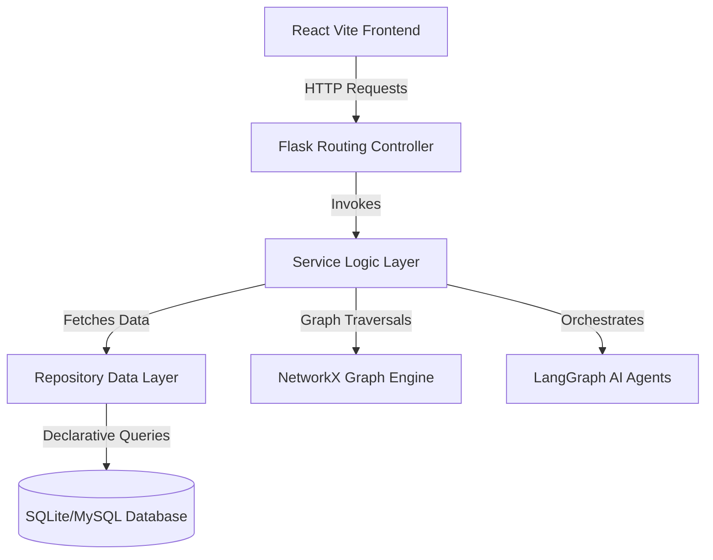

# SentinelSBOM: AI-Powered Software Supply Chain Risk Intelligence Platform

SentinelSBOM is a commercial-grade cybersecurity platform that scans and audits Software Bills of Materials (SBOMs) to identify open-source dependencies vulnerabilities, licensing compliance conflicts, and repository maintenance scores.

---

## 🏗️ Architecture Design & Separation of Concerns

SentinelSBOM is built around standard enterprise patterns to ensure strict separation of concerns, scalability, and testability.



### Layer Responsibilities
1. **Controllers Layer (`app/controllers/`)**: Extracts request payloads, checks roles, handles file streams, and calls services.
2. **Service Layer (`app/services/`)**: Orchestrates business rules. Calculations (e.g. CVSS severity, license compatibility matrices, composite risk engine scores, NetworkX graph traversals, and ReportLab canvas PDF generation) happen strictly in this layer.
3. **Repository Layer (`app/repositories/`)**: Abstracts query operations from SQLAlchemy models.

---

## 🚀 Installation & Local Setup

### 1. Backend Service Setup
1. Navigate to the `backend` folder and create a python virtual environment:
   ```bash
   cd backend
   python -m venv venv
   # Activate on Windows:
   .\venv\Scripts\Activate.ps1
   # Activate on Linux/macOS:
   source venv/bin/activate
   ```
2. Install python dependencies:
   ```bash
   pip install -r requirements.txt
   ```
3. Initialize tables and seed the database with mock CVE profiles, default licenses rules, and roles permissions:
   ```bash
   python seed.py
   ```
4. Start the development server (listens on `http://127.0.0.1:5000`):
   ```bash
   python wsgi.py
   ```

### 2. Frontend Application Setup
1. Navigate to the `frontend` folder:
   ```bash
   cd ../frontend
   ```
2. Install npm packages:
   ```bash
   npm install
   ```
3. Boot the Vite hot-reloading dev server (runs on `http://localhost:5173`):
   ```bash
   npm run dev
   ```

---

## 🐳 Containerized Production Deployment

SentinelSBOM is fully Dockerized. To spin up both the Flask backend (port `5000`) and Nginx frontend (port `80`), run:
```bash
docker-compose up --build
```

---

## 📋 API Dictionary Reference

| Method | Endpoint | Access Level | Description |
|---|---|---|---|
| **POST** | `/api/auth/login` | Anonymous | Authenticates credentials and issues signed JWT tokens. |
| **POST** | `/api/auth/register` | Anonymous | Registers a new account profile (default: `viewer`). |
| **GET** | `/api/dashboard/summary` | Authenticated | Compiles executive KPI metrics across all applications. |
| **GET** | `/api/dashboard/search` | Authenticated | Executes unified text search query across apps, CVEs, and libs. |
| **POST** | `/api/sbom` | Authenticated | Stages uploaded CycloneDX/SPDX/CSV file. |
| **POST** | `/api/sbom/<id>/parse` | Authenticated | Triggers version matching, transitive calculations, and risk updates. |
| **GET** | `/api/vulnerabilities/application/<id>` | Authenticated | Retrieves CVE list affecting application libraries. |
| **GET** | `/api/licenses/application/<id>` | Authenticated | Audits licenses compliance and alerts copyleft violations. |
| **GET** | `/api/maintenance/application/<id>` | Authenticated | Audits repository updates frequency and bus factor metrics. |
| **GET** | `/api/risk/application/<id>` | Authenticated | Fetches latest composite risk aggregates and subscores. |
| **POST** | `/api/risk/application/<id>/calculate` | Admin/Security | Triggers composite scoring recalculation. |
| **GET** | `/api/attack-paths/application/<id>` | Authenticated | Resolves dependency graph edges and visual paths. |
| **POST** | `/api/copilot/chat` | Authenticated | Processes NLP queries routing to multi-agent advisors. |
| **GET** | `/api/reports/pdf/<id>` | Authenticated | Generates and downloads professional PDF executive reports. |
| **GET** | `/api/notifications` | Authenticated | Retrieves active dashboard warnings notifications alert logs. |
